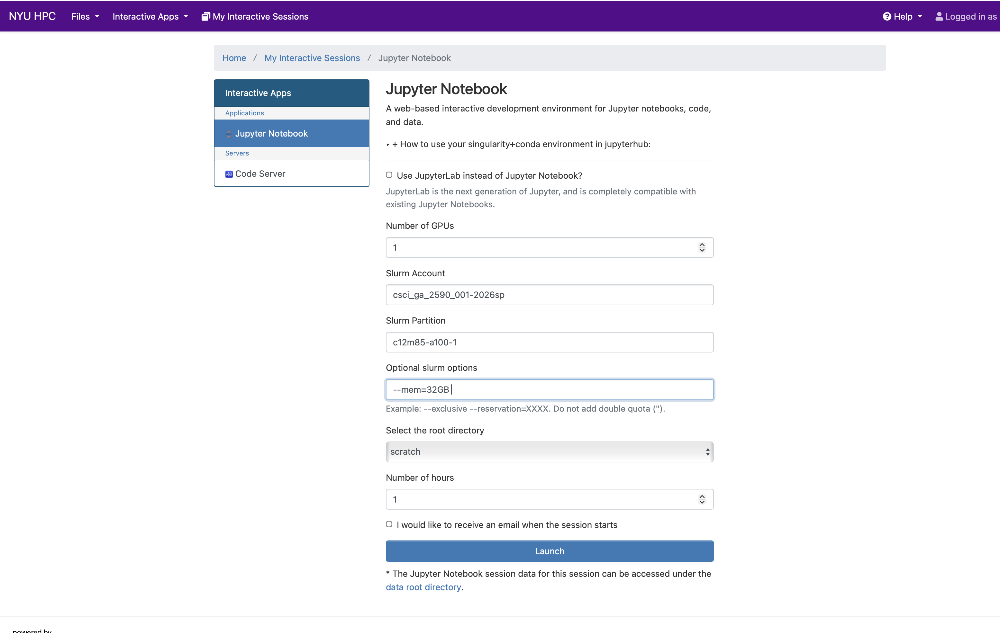
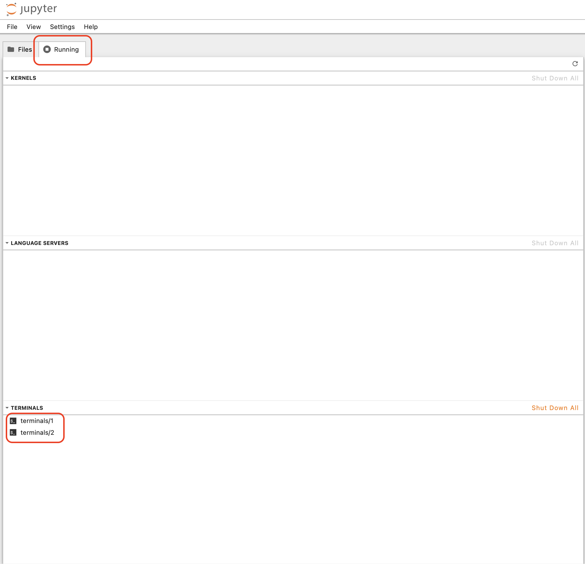
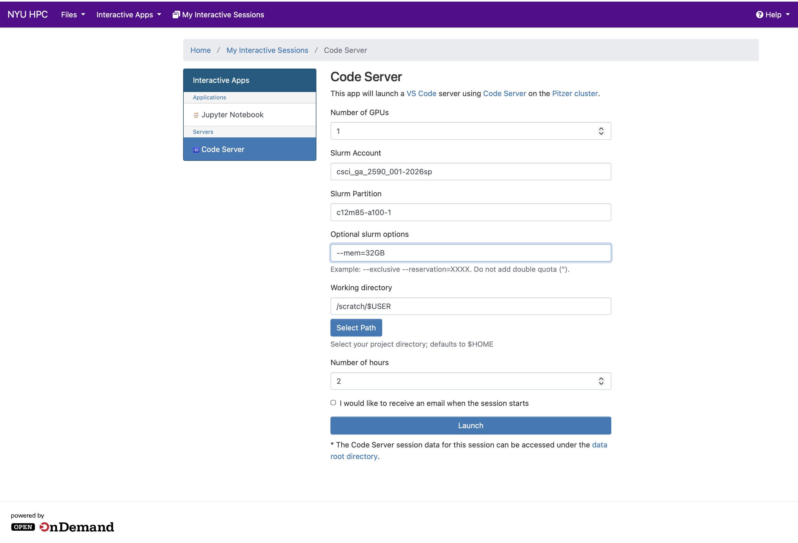

# HPC Tutorial
This is a tutorial on how to use the HPC cluster. For this course, we will be using the burst node. All students are provided with an account on the HPC cluster with access to the burst node. Burst nodes are nodes that are not part of the regular cluster and are used for short-term, high-performance computing tasks. They are preemptible VMs on GCP.


## Burst Node
Burst node access is provided exclusively via Open OnDemand a.k.a. OOD. You can access it at [https://ood-burst-001.hpc.nyu.edu/](https://ood-burst-001.hpc.nyu.edu/). 

> Since the greene cluster has been deprecated. The access to Burst node is provided exclusively via OOD. 

Only through this OOD server, you can:
 - Launch compute nodes
 - Run Jupyter notebooks
 - Open Jupyter notebook terminal sessions
 - Transfer some data from local computers
 - Submit batch jobs directly from Jupyter notebook terminals


## Before you begin
Make sure you clear the cookies and cache of your browser related to ood or hpc. You can do this by going to [chrome://settings/content/all?searchSubpage=ood.torch.hpc.nyu.edu&search](chrome://settings/content/all?searchSubpage=ood.torch.hpc.nyu.edu&search)


## Login
Go to the [OOD URL](https://ood-burst-001.hpc.nyu.edu/) and login with your NYU credentials. You will be redirected to the NYU SSO page. Login with your NYU credentials. You will be redirected to the OOD page. You will see a page with a list of applications.


## Launching a Jupyter Notebook/Lab.

Click on the "Jupyter Notebook" application on the [landing page](#login) You will be redirected to a page where you can configure the JupyterLab environment. 


in the example shown [above](#launching-a-jupyter-notebooklab), we have used the following configuration:
- `c12m85-a100-1` partition, which has 1 A100 40GB GPU.
- `csci_ga_2590_001-2026sp` account
- `--mem=32GB` memory
- 1 GPU. You can also give `--gres=gpu:1` to request 1 GPU.

Click on the "Launch" button to launch the Jupyter Notebook environment.

## Partitions and Account

Before we begin, let's understand the partitions and accounts available on the HPC cluster. All students are provided with an account on the HPC cluster with access to the burst node.

- **Account:** `csci_ga_2590_001-2026sp`

  300 GPU hours (18,000 minutes)


- **Partitions:**
  - `interactive` (for lightweight tasks)
  - `n2c48m24` —> CPU only
  - `g2-standard-12` —> 1 L4 GPU
  - `g2-standard-24` —> 2 L4 GPUs
  - `g2-standard-48` —> 4 L4 GPUs
  - `c12m85-a100-1` —> 1 A100 40GB GPU
  - `c24m170-a100-2` —> 2 A100 40GB GPUs
  - `n1s8-t4-1` —> 1 T4 GPU


## Understanding the Filesystem 
You may move on to the [next section](#launching-terminal) if you are familiar.

- The Torch HPC cluster/ compute node has different directories optimized for various storage needs.

    | Directory  | Variable   | Purpose                | Flushed After | Quota             |
    |------------|------------|------------------------|---------------|-------------------|
    | `/archive` | `$ARCHIVE` | Long-term storage      | No            | 2TB / 20K inodes  |
    | `/home`    | `$HOME`    | Configuration files    | No            | 50GB / 30K inodes |
    | `/scratch` | `$SCRATCH` | Temporary data storage | Yes (60 days) | 5TB / 1M inodes   |
    | `/vast` | `$VAST` | Workflows with very high read/write demands | Yes (60 days) | 2TB / 5M inodes   |

### Burst Filesystem

Torch's `/home` and `/scratch` are mounted (available) at login node of bursting setup.

Compute node however, do have independent `/home` and `/scratch`. These `/home` and `/scratch` mounts are persistent, are available from any compute node and independent from `/home` and `/scratch` at Torch.

User may need to copy data from Torch's `/home` or `/scratch` to GCP mounted `/home` or `/scratch`.

When you run a bursting job the compute nodes will not see those file mounts. This means that you need to copy data to the burst instance.

The file systems are independent, so you must copy data to the GCP location (Burst node).

To copy data, you must first start an interactive job on the burst node (eg: via Jupyter Notebook terminal). Once started, you can copy your data using scp from the HPC Data Transfer Nodes (torch-dtn). Below is the basic setup to copy files from Torch to your home directory while you are in an interactive bursting job:

`scp $USER$@dtn.torch.hpc.nyu.edu:/path/to/files /scratch/$USER/`


## Launching Terminal. 

You can launch a terminal session from the Jupyter Notebook environment by -> Launch -> Jupyter Notebook -> File -> New -> Terminal.

<video style="width: 100%; height: auto;" controls playsinline preload="metadata">
  <source src="./Launch%20Jupyter.mov" type="video/quicktime">
  Your browser does not support the video. Reload in Chrome
</video>

> Make sure that pop up is not blocked by your browser when you open terminal

You view all running terminal inside the "Running" tab of Jupyter Notebook. 


## Singularity | Containers for HPC

### What is Singularity? 
Singularity is a container based Linux kernel workspace that works just like Docker. You can run pre-built programs in containers without having to worry about the pre-install environment. The Singularity we use is actually an alias for the name Apptainer. 

### Understanding the Singularity Image Def. Files.

Singularity image definition files are read-only by default. But you need write access into install your python libraries. This is where the a writable overlay comes into play. It is like an virtual disk that can be mounted along with containers to provide storage capabilities for installing your libraries. The following figure captures the abstraction.


 
### Copying Singularity Image Def. Files.

Since we would be using Deep Learning libraries like huggingface, pytorch, etc. We would use singularity images with pre-installed CUDA kernels. 

WE HIGHLY RECOMMEND YOU TO USE THE SINGULARITY IMAGE FROM THE HPC TUTORIAL REPOSITORY. 

> :warning: When you copy the singularity image def. file, make sure you copy the file with the right cuda version. Pytorch will throw an error if your pytorch version is not compatible with the cuda version in the singularity image. You can 

- The singularity image defition files can be found at `/share/apps/images/`. 
- The overlay files can be found at `/scratch/work/public/overlay-fs-ext3/`. . Each overlay file has a different size and has a certain file limit. We will be using the 25GB overlay file which has a file limit of 500,000 files. This will be sufficient for all our assignments.


We will be using the following configuration for our tutorial here:

- Python: 3.11 
- Pytorch: 2.6.0
- CUDA: 12.6.3 

You can use any other compatible versions as well. Refer to the [Pytorch official documentation](https://pytorch.org/get-started/previous-versions/) for finding the compatible versions.


```bash
# Go to the scratch directory
[ar6316@b-19-50 ~]$ cd /scratch/$USER

# Copy the singularity image file to scratch.
[ar6316@b-19-50 ~]$ cp /share/apps/images/cuda12.6.3-cudnn9.5.1-ubuntu22.04.5.sif . # Note that we have used cuda12.6.3 version.

# Copy the overlay file to scratch
[ar6316@b-19-50 ~]$ cp /scratch/work/public/overlay-fs-ext3/overlay-25GB-500K.ext3.gz . 

# Unzip. 
[ar6316@b-19-50 ~]$ gunzip -vvv ./overlay-25GB-500K.ext3.gz


# [Optional] ls to verify you have copied all the correct files. 
[ar6316@b-19-50 ~]$ ls
```


Once you have copied all the files, start the singularity container. 

```bash
[ar6316@b-19-50 ~]$ singularity exec --bind /scratch --nv --overlay  /scratch/$USER/overlay-25GB-500K.ext3:rw /scratch/$USER/cuda12.6.3-cudnn9.5.1-ubuntu22.04.5.sif /bin/bash 
```

```
Singularity> 
Singularity> pwd
/scratch/[NetId]
Singularity> 
```

Inside the singularity container, we will use conda to install python. We will use miniconda for this purpose. You can also use miniforge as an alternative. [Refer here](https://services.rt.nyu.edu/docs/hpc/containers/singularity_with_conda/) for more details

```bash

# change directory
Singularity> cd /ext3/

# Download miniconda
Singularity> wget https://repo.anaconda.com/miniconda/Miniconda3-latest-Linux-x86_64.sh

# Install miniconda
Singularity> bash ./Miniconda3-latest-Linux-x86_64.sh -b -p /ext3/miniconda3
```

To source the conda and add conda to PYTHONPATH. You should modify your `~/.bashrc` file and paste the following lines. You should restart your `bash` to get these changes reflected.

```bash
source /ext3/miniconda3/etc/profile.d/conda.sh
export PATH=/ext3/miniconda3/bin:$PATH
```


Now let's create a conda environment for our NLP Course. 

```bash
Singularity> conda create -n nlp_env python==3.11
Singularity> conda activate nlp_env
```

Before you install pytorch, you need to set the TMPDIR environment variable to a directory in your scratch space. This is because the default temporary directory is too small and may cause the installation to fail. 

```bash
(nlp_env) Singularity> pip install torch==2.6.0 torchvision==0.21.0 torchaudio==2.6.0 --index-url https://download.pytorch.org/whl/cu126
```

Now test your pytorch installation.

```bash
(nlp_env) Singularity> python -c "import torch; print(torch.__version__); print(torch.cuda.is_available())"
2.6.0+cu126
True
```

Now exit your container.

## Submitting a SLURM Job. 
The jobs to run your code is submitted using SBATCH. Create a SBATCH file in your burst node OUTSIDE YOUR SINGULARITY container. 

Download a sample test file. 

```bash
[ar6316@b-19-50 ~]$ wget https://nyu-cs2590.github.io/course-material/fall2023/section/sec03/test_gpu.py
```

Create a SBATCH file.
```bash
[ar6316@b-19-50 ~]$ vim gpu_test.sbatch
```

And then paste the following lines in the `gpu_test.sbatch` file. You can read more about the SBATCH over [here](https://slurm.schedmd.com/pdfs/summary.pdf)

```bash

#!/bin/bash
#SBATCH --job-name=job_wgpu
#SBATCH --account=csci_ga_2590_001-2026sp
#SBATCH --partition=c12m85-a100-1
#SBATCH --open-mode=append # Append to the output file. If you don't use this, the output will be overwritten.
#SBATCH --output=./%j_%x.out # %j is the job id, %x is the job name.
#SBATCH --error=./%j_%x.err
#SBATCH --export=ALL # Export all the environment variables to the job.
#SBATCH --time=00:10:00 
#SBATCH --gres=gpu:1 # Request 1 GPU.
#SBATCH --requeue # Requeue the job if it fails.


singularity exec --bind /scratch --nv --overlay  /scratch/$USER/overlay-25GB-500K.ext3:rw /scratch/$USER/ubuntu-20.04.3.sif /bin/bash -c "

```

Then submit your sbatch file.

```bash

[ar6316@b-19-50 ~]$ sbatch gpu_test.sbatch # Submit the sbatch file.
[ar6316@b-19-50 ~]$ squeue -u $USER # check the status of jobs you have submitted.

```

You shall rename over your overlay and singularity image for easy reference. This will be easy in case you have multiple batch jobs. 

```bash
# Rename the overlay file
[ar6316@b-19-50 ~]$ mv /scratch/$USER/overlay-25GB-500K.ext3 /scratch/$USER/nlp-25GB-500K-v1.ext3

# Rename the singularity file.
[ar6316@b-19-50 ~]$ mv /scratch/$USER/cuda12.6.3-cudnn9.5.1-ubuntu22.04.5.sif /scratch/$USER/nlp-v1.sif
```

Write multiple sbatch files each referring to a different singularity image and overlay file. 

> :warning: You cannot use the same singularity image file for different job submissions. Write separate sbatch files each referring to a different singularity image and overlay file for different jobs. 


## [Additional] Code Server
Click on the "Code Server" application. You will be redirected to a page where you can configure the VS Code environment. 



in the example shown [above](#code-server), we have used the 
- `c12m85-a100-1` partition, which has 1 A100 40GB GPU.
- `csci_ga_2590_001-2026sp` account
- `--mem=32GB` memory
- 1 GPU. You can also give `--gres=gpu:1` to request 1 GPU.


